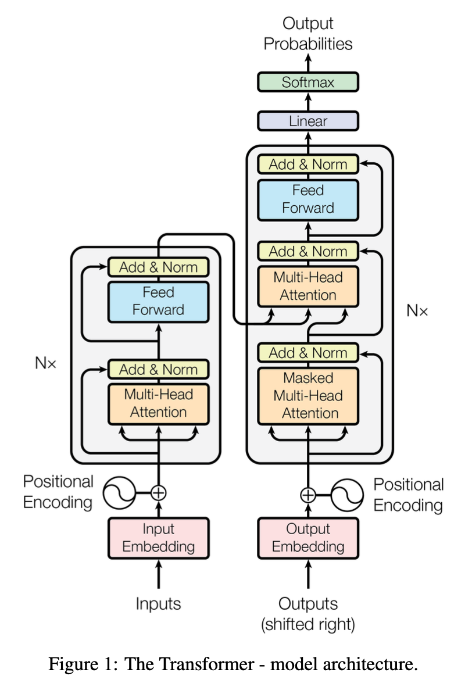

## 3 Model Architecture
> *Most competitive neural sequence transduction models have an __encoder-decoder structure__.*

**Encoder-decoder structure**

Encoder 把輸入序列 `(x1, x2, ..., xn)` 轉成另一組「連續空間的向量表示」`(z1, z2, ..., zn)`，這是內部的「語意表示」。

Decoder 做 auto-regressive，**逐字生成**，最終生成 `(y1, y2, ..., ym)`

:::note
Auto-regressive（自回歸）：每次產生下一個字時，都會依賴前面已經生成的字
:::

所以 decoder 的行為是：

1. 給 z 和 BOS（Begin of Sentence），產生 y1

2. 給 z 和 y1，產生 y2

3. 給 z 和 y1, y2，產生 y3

依此類推...

Decoder 每次都會使用「encoder 生成的 `z` + 已經生成的 `y` 序列」當作條件，來預測下一個 token，直到預測出 EOS（End of Sentence） 為止。

Transformer 就是這樣的結構，但是它使用 self-attention 取代 RNN，讓它可以並行處理序列

> The Transformer follows this overall architecture using stacked self-attention and point-wise, fully
> connected layers for both the encoder and decoder, shown in the left and right halves of Figure 1,
> respectively.

### 3.1 Encoder and Decoder Stacks

>
> Decoder: The decoder is also composed of a stack of N = 6 identical layers. In addition to the two
> sub-layers in each encoder layer, the decoder inserts a third sub-layer, which performs multi-head
> attention over the output of the encoder stack. 
> Similar to the encoder, we employ residual connections
> around each of the sub-layers, followed by layer normalization. We also modify the self-attention
> sub-layer in the decoder stack to prevent positions from attending to subsequent positions. This
> masking, combined with fact that the output embeddings are offset by one position, ensures that the
> predictions for position ican depend only on the known outputs at positions less than i.

**Encoder**

由 N = 6 個一模一樣的 layer 堆疊而成，每個 layer 有兩個 sub-layer，第一個是 **multi-head self-attention mechanism**，第二個是 **position-wise fully connected feed-forward network**

:::note
position-wise, fully connected layer 其實就是 一個 token 一個 token 跑 dense layer，每個位置（token）都會被單獨送進全連接層，但用的是 **同一組權重**。

這是為了保持 **序列長度不變**，只在「每個位置的特徵維度」上做變換。
:::

每個 sub-layer 做完時還會做 residual connection + layer normalization。換句話說，每個 sub-layer 的輸出是 `LayerNorm(x+ Sublayer(x))`，其中 `Sublayer(x)` 為每個 sub-layer 的行為。

為了 residual connection 能夠正常相加，每一層的輸入、輸出維度都要相同：`d_model` = **512**

**Decoder**

也是由 N = 6 個一模一樣的 layer 堆疊而成，但除了 encoder 的兩個 sub-layer 之外，還多了第三個 sub-layer

遮蔽 (masking) ：

Decoder 預測 y_i 時，只能看 y1 到 y(i-1)，不能偷看 y(i+1) 之後的內容（因為那些還沒生成）。
所以 masking 會用一個「上三角矩陣」遮蔽掉未來的 token，確保自回歸特性。

Offset 一格：

Decoder 的輸入會「往右偏移一格」：
例如：真實的 y = [BOS, y1, y2, y3, EOS]
預測 y1 時，input 是 BOS
預測 y2 時，input 是 BOS + y1
預測 y3 時，input 是 BOS + y1 + y2
這個 offset + masking 搭配，確保 decoder 只能用前面的 token 來預測當下的 token。

### 3.2 Attention

An attention function can be described as mapping a query and a set of key-value pairs to an output,
where the query, keys, values, and output are all vectors. The output is computed as a weighted sum
of the values, where the weight assigned to each value is computed by a compatibility function of the
query with the corresponding key.

Attention 函數可以想成是將 query 和一些 key-value pairs 映射到一個 output，而 query、keys、values 和輸出都是向量。