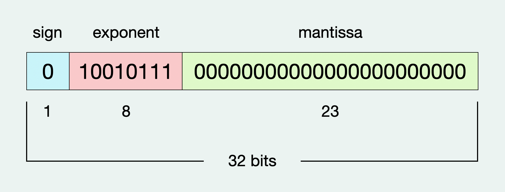

大家初次碰到浮點數時，想必都有聽說過「誤差」這個問題，也就是浮點數儲存在電腦時的值與我們所期望的不同。假設有一天，小明突然問你：「為什麼會有誤差？」，如果你知道 IEEE 754 標準，你可能會回答：「因為電腦儲存浮點數的位元有限，所以......」，但是小明不滿意這個回答，於是提出一個請求：「你可以算給我看嗎？」


## 感受浮點數誤差
在正式開始之前，讓我們先來感受一下浮點數誤差的迷人之處～

```c
#include <stdio.h>

int main() {
    float num = 16777217.0f;
    printf("num     = %f\n", num);
    printf("num + 1 = %f\n", num+1);
    printf("num + 2 = %f\n", num+2);
}
```
這段程式會輸出什麼呢？連想都不用想，`num` 肯定就是 16777217 啊，`num+1` 是 16777218，`num+2` 是 16777219

「沒有錯！但是錯了！！」

如果我們把這段程式拿去執行，會得到這樣的結果：
```
num     = 16777216.000000
num + 1 = 16777216.000000
num + 2 = 16777218.000000
```
什麼！怎麼會這樣？讓我們繼續看下去吧！


## IEEE 754 簡介
現在的電腦在儲存小數點時有一個統一的格式標準，就是眾所週知的 [IEEE 754](https://zh.wikipedia.org/zh-tw/IEEE_754)，其中還可以分成 32 bits 的單精度格式和 64 bits 的雙精度（倍精度）格式。

單精度的格式如下：



上述例子的 `num` 就屬於一個單精度浮點數。

（有關 IEEE 754 詳細的介紹可以參考其他大神的文章）


## 浮點數誤差來自哪裡
拿前面舉例的數字 `16777217` 為例，我們先把它用二進位表示（可以藉助 [線上轉換工具](https://www.rapidtables.com/convert/number/decimal-to-binary.html?x=16777217)），會得到
```
1000000000000000000000001 
// 有 23 個 0
```
用科學記號表示即為
```
1.000000000000000000000001 * 2^24
```
接著再轉換成 IEEE 754 單精度浮點數格式，變成
```
0 10010111 00000000000000000000000
```
這時你會發現，最後一個 1 放不進去 mantissa 欄位

**誤差就是在這裡產生的**。

我們再把這個結果轉換回十進位（過程省略），會得到 `16777216`，跟一開始程式的輸出一模一樣！但這時電腦裡紀錄的數字已經不是我們給的了。

從這裡我們可得知一件事：有一些數字是沒有辦法用 IEEE 754 表示的。

## Rounding
上面的例子可以看出，用科學記號表示後，小數點後的數字有可能無法全部放入 mantissa 欄位，進而產生誤差。那麽多出來的數字要怎麼處理？無條件捨去嗎？還是無條件進位？

IEEE 754 預設的方法稱為 **"Round to Nearest, Ties to Even"**，也就是「四捨六入五成雙」

「四捨六入五成雙」在二進位的世界裡就會變成如下的規則：

稱 LSB (least significant bit) 為要保留的最後一位
1. 四捨：LSB 的右邊第一個 bit 為 0，則捨去
2. 六入：LSB 的右邊第一個 bit 為 1，且右邊第二個 bit 也為 1，則進位
3. 五成雙：LSB 的右邊第一個 bit 為 1，但右邊第二個 bit 為 0，此時如果 LSB 為 0，則捨去，反之則進位（記憶法：讓最終結果 LSB 是 0）

了解上述的規則後，我們可以輕鬆的驗證以下表格的內容
> Expected 為我們要存的值，Actual 為使用 IEEE 754 儲存後的值，Error 為誤差

| Expected (E) | Actual (A) | Error (A - E) |
|--------------|------------|---------------|
| 16777217     | 16777216   | -1 |
| 16777218     | 16777218   | 0 |
| 16777219     | 16777220   | +1 |
| 16777220     | 16777220   | 0 |
| 16777221     | 16777220   | -1 |
| 16777222     | 16777222   | 0 |
| 16777223     | 16777224   | +1 |
| 16777224     | 16777224   | 0 |

以 `16777219` 為例，用二進位科學記號表示為
```
1.000000000000000000000011 * 2^24
                        ^
                       LSB
```
取到小數點後第 23 位，則 LSB 是 1，LSB 右邊第一個 bit 為 1，右邊第二個 bit 為 0 (沒有值視同 0)，所以要進位，變成
```
1.00000000000000000000010 * 2^24
                        ^
                       LSB
```
再轉換回十進位表示，得到值為 `16777220`，誤差為 +1

以此類推，也可以算出其它數字的誤差～

下次遇到小明的時候，就可以充滿自信的算給他看了！🥳
> ## 相關線上工具
> ### 各進制轉換
>* [RapidTables](https://www.rapidtables.com/convert/number/binary-to-decimal.html)：二進制和十進制的轉換（還有很多功能）
>### IEEE 754 Converter
> * [numeral-systems](https://numeral-systems.com/ieee-754-converter/)：會寫出所有十進位和 IEEE 754 浮點數之間的轉換步驟
> * [h-schmidt](https://www.h-schmidt.net/FloatConverter/IEEE754.html)：有特別寫出浮點數誤差值