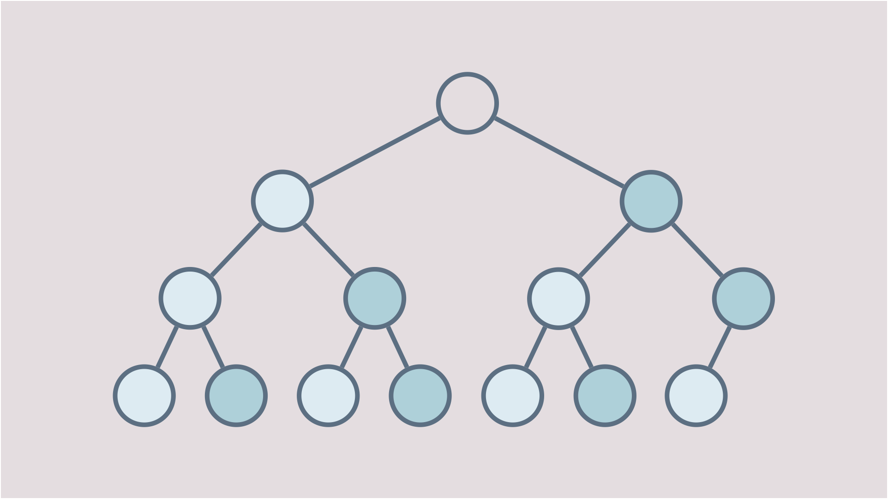

## 定義
是一個 root 沒有 data 的  complete binary tree ，並且擁有以下性質：
1. 左兄弟 ≤ 右兄弟
2. 如果一個節點 x 有祖父，則祖父的左小孩 ≤ x
3. 如果一個節點 x 有祖父，則祖父的右小孩 ≥ x

:::tip
透過定義和觀察可以得出，對任一點 i，以 i 為 root 的子樹中：
* i 的左小孩是除了 i 以外的最小值
*  的右小孩是除了 i 以外的最大值
:::

## 操作
可以對 Symmetric min-max heap（SMMH）做的操作一共有五種：[插入](#插入-x)、[刪除最小值](#刪除最小值)、[刪除最大值](#刪除最大值)、[取得最小值](#取得最小值)、[取得最大值](#取得最大值)。

### 插入 x
1. 將 x 放在最後一個節點的下一個位置
2. 維持性質 。如果 x 有兄弟，則它們兩個必須滿足 左兄弟 ≤ 右兄弟
3. 繼續調整以維持性質 2 和性質 3
    
    a. 如果 x ≥ x 的祖父的左小孩，則滿足性質 2，否則兩者互換
    
    b. 如果 x ≤ x 的祖父的右小孩，則滿足性質 3，否則兩者互換

:::tip
此步驟如果有互換的動作發生，x 的祖父就會改變，所以要再檢查一次。
:::

4. 重複步驟 3，直到 滿足性質 或 沒有祖父 為止

> #### 實際演練
> 拿定義提供的範例為例，插入一個節點 3
> * **步驟 1** - 將 x 放在最後一個節點的下一個位置
> * **步驟 2** - 維持性質 1
>  
>   沒有兄弟，所以不做任何動作
> 
> * **步驟 3** - 繼續調整以維持性質 2 和性質 3
>
>   3 的祖父（80）的左小孩（13）比它大，兩者互換
>
>   互換後，3 的祖父（root）的左小孩（6）比它大，再互換一次
>
> 此時 3 沒有祖父了，結束。

### 刪除最小值
1. 移除左子樹的 root，形成空格 E，並將最後一個節點刪除，值暫存起來，稱為 x
2. 找出 **E 的左小孩** 和 **E 的右兄弟的左小孩** 之中較小的一個，我們稱之為 m，如果 m < x，將 m、E 對調；如果 m ≥ x 或 E 沒有小孩時，將 x 填入空格
:::note
此步驟主要目的是要滿足性質 2，即 **x 的祖父的左小孩 ≤ x**。

現在有一個空格 E，而 E 的值必須 ≤ E 的小孩 和 E 的右兄弟的小孩，所以我們可以尋找 E 的小孩所在的那一層中的最小值。又因為性質 1 **左兄弟 ≤ 右兄弟**，所以只要考慮左小孩就好，即 **E 的左小孩** 和 **E 的右兄弟的左小孩** 兩個值之中較小的一個。將這個值和 E 互換不會影響到性質 2。

當 x ≤ m 時，表示我們在步驟 1 移除的節點比那兩個值還小，因為 x 已經不在樹中了，所以將它填入空格 E，此時不但滿足性質 2，空值也消失了。

當 E 沒有小孩時，表示沒有人可以跟它互換，因此只能將 x 填入 E。

空格被填入後就表示所有節點都滿足性質 2，所以只要再檢查一次性質 1 後就完成了。
:::

3. 檢查 x 和 E 的右兄弟是否滿足性質 1

    a. x ≤ E 的右兄弟：不做任何事

    b. x > E 的右兄弟：將 x 和 E 的右兄弟的值互換
4. 重複步驟 2、步驟 3，直到滿足所有性質

### 刪除最大值
與刪除最小值的做法幾乎一樣，步驟如下：
1. 移除右子樹的 root，形成空格 E，並將最後一個節點刪除，值暫存起來，稱為 x
2. 找出 **E 的右小孩** 和 **E 的左兄弟的右小孩** 之中較大的一個，我們稱之為 m，如果 m > x，將 m、E 對調；如果 m ≤ x 或 E 沒有小孩時，將 x 填入空格
3. 檢查 x 和 E 的左兄弟是否滿足性質 1

    a. x ≥ E 的左兄弟：不做任何事

    b. x < E 的左兄弟：將 x 和 E 的左兄弟的值互換
4. 重複步驟 2、步驟 3，直到滿足所有性質

### 取得最小值
Root 的左小孩即為最小值。

### 取得最大值
Root 的右小孩即為最大值。

## 複雜度
|操作     |時間複雜度|說明 |
|---------|--------|---------------|
|插入 x    |O(logn) |x 一開始是 leaf，最多會被替換到 level 2，約 logn 次 |
|刪除最小值 |O(logn) |空格 E 最多會被替換到 leaf，約 logn 次 |
|刪除最大值 |O(logn) |空格 E 最多會被替換到 leaf，約 logn 次 |
|取得最小值 |O(1)    |直接取 root 的左小孩，常數時間 |
|取得最大值 |O(1)    |直接取 root 的右小孩，常數時間 |